# 调度延迟分析


## 一）、Top N 延迟分析

目的是找出最大的TOP N 延迟及其根因。

为了方便，利用操作系统的领域知识，写了一个SQL，查询出调度延迟大于100us的线程，并关联查询出所在的CPU、优先级，时间片等信息，
为后继的分析做好准备：

```
select ts.ts, ts.dur, ts.utid, th.tid, th.name, ss.cpu, ss.priority
from thread_state as ts  left join thread as th using (utid) left join sched_slice as ss on (ts.ts + ts.dur = ss.ts)
where ts.state = 'R' and ts.dur >= 100000 
order by ts.dur desc

```

以一个现场的case为例，执行上述SQL，调度延迟从大到小排序如下：

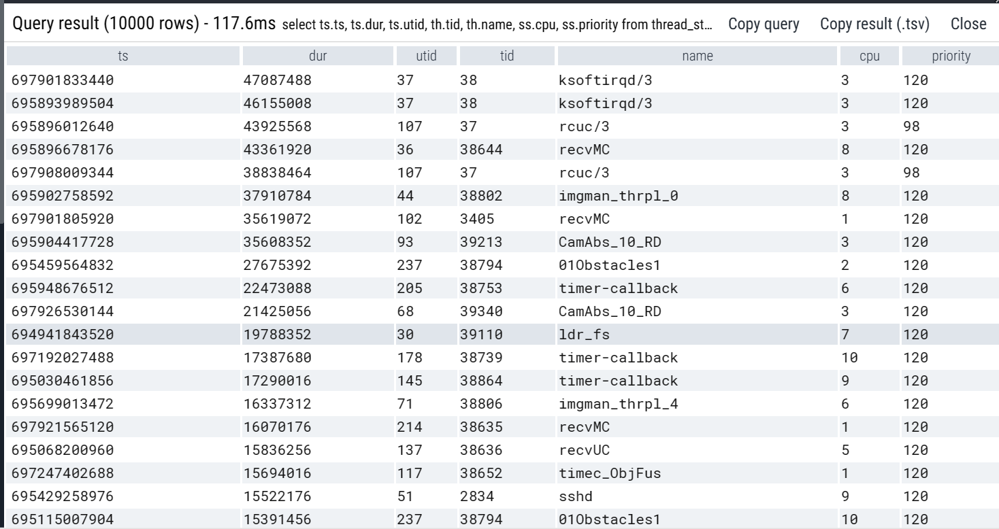

分别分析这些case。

### 1、内核线程ksoftirq、rcu等延迟了40ms+

怀疑是被某一个实时进程所阻塞，需要进一步分析。

为了方便，继续写了一个SQL，查询出指定时间段、指定CPU上，有哪些线程在运行：

```
select * from 
sched_slice left join thread using (utid)
where 
(ts + dur) >= 697901833440 and (ts + dur) <= (697901833440 + 47087488) and cpu = 3
```

以这个case为例，运行上述SQL即可找出该cpu在异常时间段内的执行情况如下：
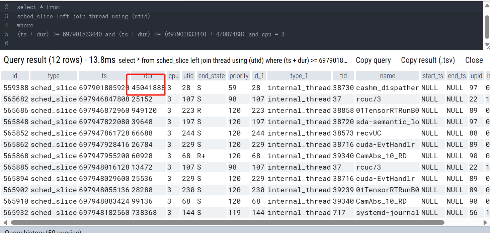

可见，高优先级的实时线程cashm_dispather执行了45ms，堵塞了这个cpu上的所有其他线程。

回到perfetto，仔细展开对应的线程和cpu，也可以直观的看：
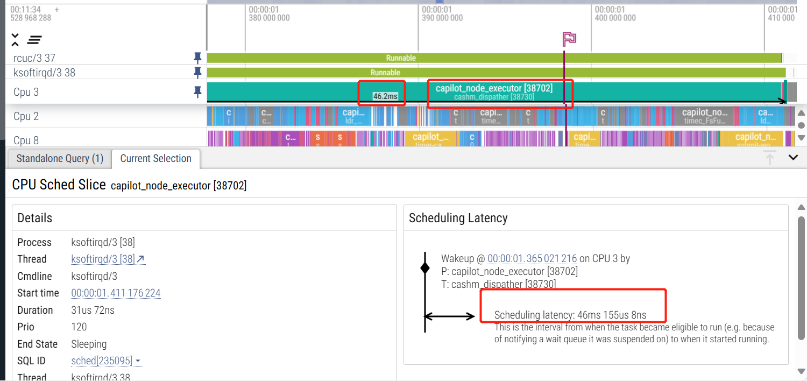

小结：
--》高优先级的实时线程cashm_dispather执行了45ms，堵塞了cpu 3上的所有其他线程。

### 2、recvMC线程延迟了40ms+

分析被阻塞的时间段内，该cpu上的执行情况如下：

```
select * from 
sched_slice left join thread using (utid)
where 
(ts + dur) >= 695896678176  and (ts + dur) <= (695896678176  + 43361920) and cpu = 8
order by dur desc

```

占用cpu时间从大到小排列，如图：
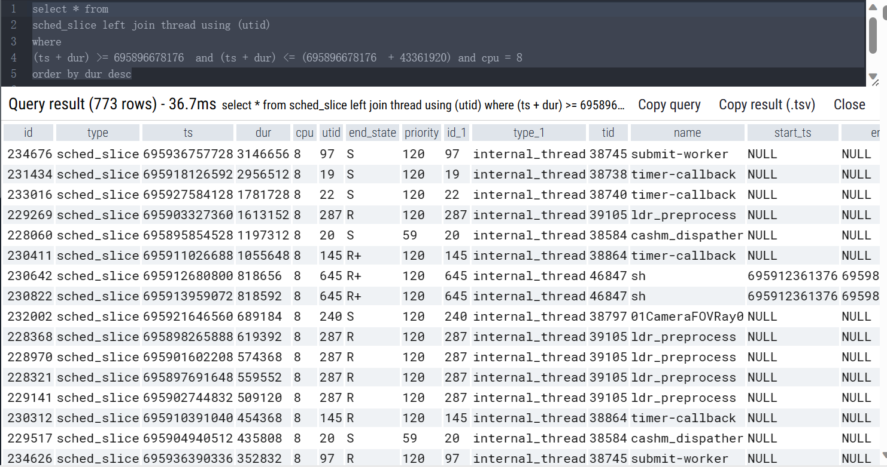

小结：
---》 
这个CPU上的业务部署较密，主要业务线程都集中在这个核上，超过1ms的线程需要关注；
一些sh脚本也需要关注（时延敏感软件所运行的cpu上，不应该存在重量级的shell脚本）；
上一步看到的实时线程（cashm_dispatcher）也在这个核上跑。


### 3、imgman_thrpl_0线程延迟37ms+

分析被阻塞的时间段内，该cpu上的执行情况如下：

```
select * from 
sched_slice left join thread using (utid)
where 
(ts + dur) >= 695902758592  and (ts + dur) <= (695902758592  + 37910784) and cpu = 8
order by dur desc

```

占用cpu时间从大到小排列，如图：
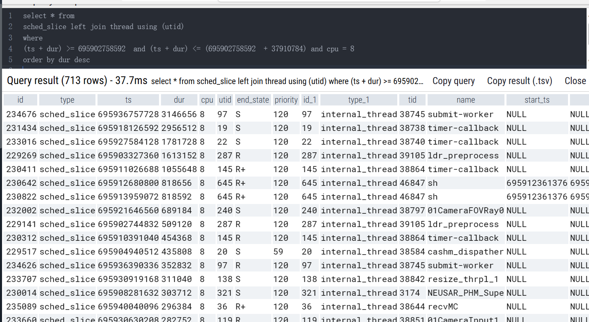

小结：
--》
这个CPU上的业务部署较密，主要业务线程都集中在这个核上，超过1ms的线程需要关注；
一些sh脚本也需要关注（时延敏感软件所运行的cpu上，不应该存在重量级的shell脚本）；
上一步看到的实时线程（cashm_dispatcher）也在这个核上跑。


### 3、CamAbs_10_RD延迟30ms+
分析被阻塞的时间段内，该cpu上的执行情况如下：

```
select * from 
sched_slice left join thread using (utid)
where 
(ts + dur) >= 695904417728  and (ts + dur) <= (695904417728  + 35608352) and cpu = 3
order by dur desc

```
占用cpu时间从大到小排列，如图：
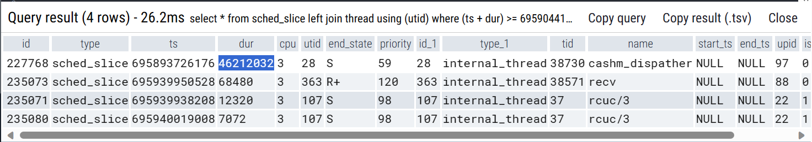

调度延迟只有35ms，但是长期占据cpu的cashm却运行了40ms+，是不是分析得不对呢？

专门再去展开对应线程&cpu的图，确认是一致的：
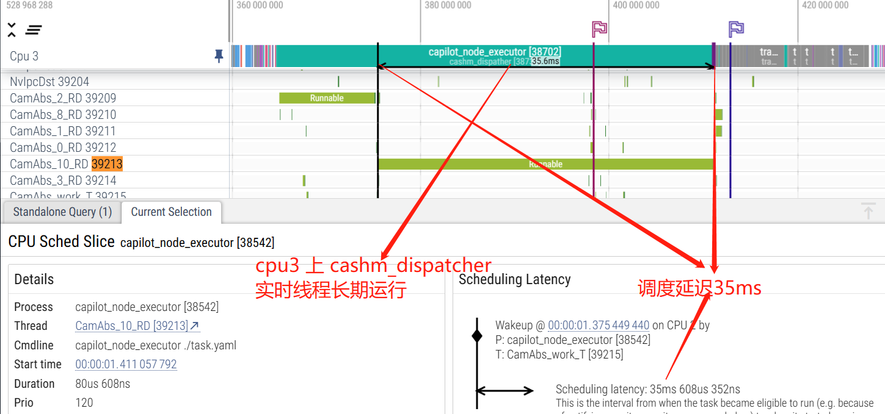


### 4、小结：
利用操作系统的领域知识，通过编写sql的方式，基本上可以定位到目标线程的调度延迟是由具体CPU上的哪些线程长时间运行所引起的。这些信息可以帮助业务同学进行优化，比如从上面的信息，可以得到行动项：时延敏感业务必须和高优先级实时业务隔离开；由于都是普通优先级，也要避免和CPU密集型的业务部署到同一个核；一些重量级的操作（比如执行shell命令），也要优化。如果业务方牵扯太多、修改困难，则可以考虑cgroup或者轻量级容器的方式，在对业务透明的情况下进行资源限制。


## 二）、FREQ延迟分析

这一步主要是扩展一下，探索一下数据集中的规律，目的是找出哪些进程或者哪些CPU容易出现延迟。

```
create view cpu_thread_delay as 
select ts.ts, ts.dur, ts.utid, th.tid, th.name, ss.cpu, ss.priority
from thread_state as ts  left join thread as th using (utid) left join sched_slice as ss on (ts.ts + ts.dur = ss.ts)
where ts.state = 'R' 
```

- 分析调度延迟和CPU的关系
  
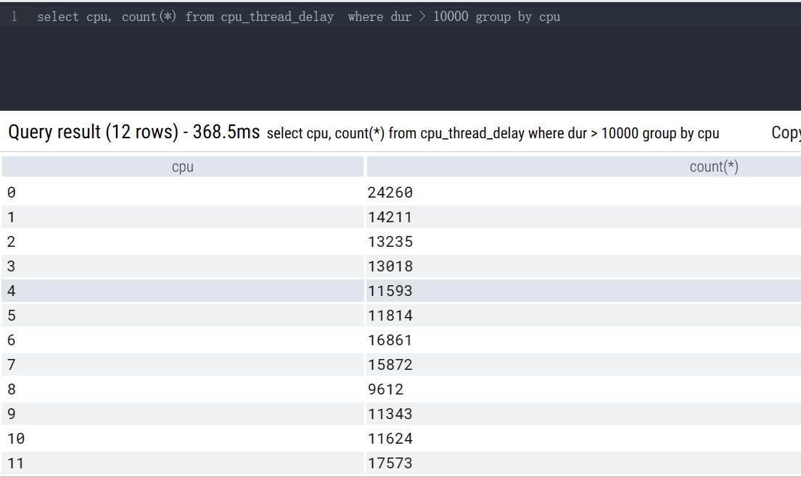

---》 大于10us的调度延迟，CPU0 最多，原因是中断都集中在CPU0上。

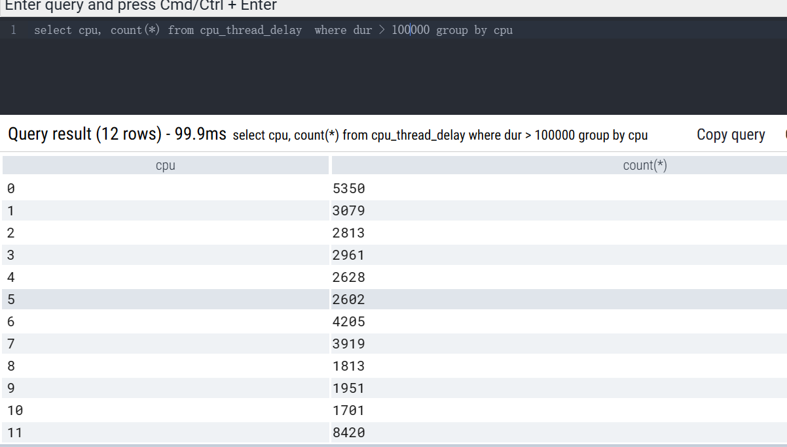

---》 大于100us的调度延迟，CPU11 最多，和CPU11 的特殊业务有关。
 
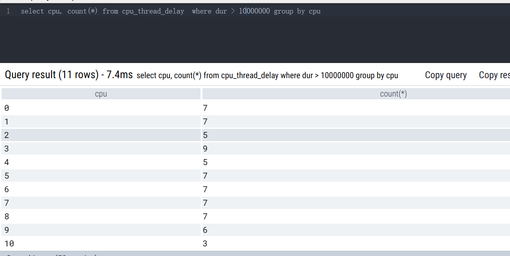

---》 大于10ms的调度延迟，CPU3 最多，和CPU3 上的实时线程有关系； cpu 11没有大于10ms的调度延迟，说明这个CPU上的业务还是符合预期。
 
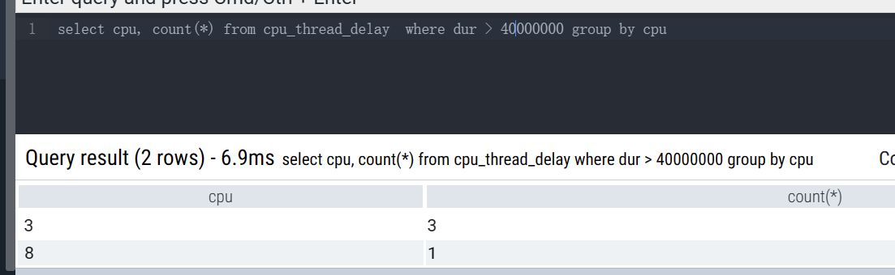

---》 大于40ms的调度延迟，只在CPU3 和 CPU8 存在，和它们上面的实时线程、以及业务部署情况有关系。
 
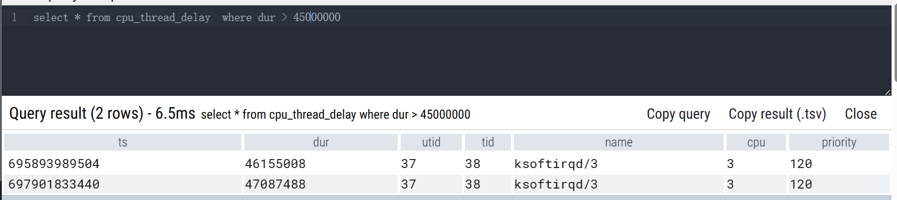

---》 大于45ms的调度延迟，只在CPU3存在，和实时线程有关系。
 

小结：
CPU0 上有中断，会引起频繁的、较小的调度延迟；
CPU11 可能是有特殊用途，有大量中等程序的调度延迟，但没有大的调度延迟；
CPU8 业务部署比较密，有较大的调度延迟；
CPU3 上长期有实时业务，引起了最大的调度延迟。

它更进一步说明CPU本身也不是对等的，SoC厂商已经对CPU资源有规划，比如CPU0 用于中断；CPU N用于XX特殊用途。这种情况下，我们还把CPU都看成彼此等价的PE，把我们的业务线程一股脑怼过去、完全依靠kernel来做理想化的调度，就不合适了。我们需要进一步，利用已知的业务先验知识，来帮助kernel进行调度，比如对CPU资源进行划分：时延敏感的业务跑哪些核、CPU密集型业务跑哪些核、运维监控的业务跑哪些核等。


